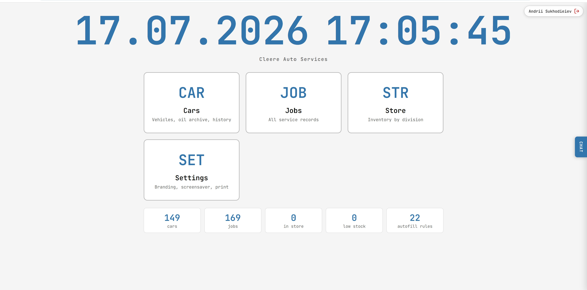
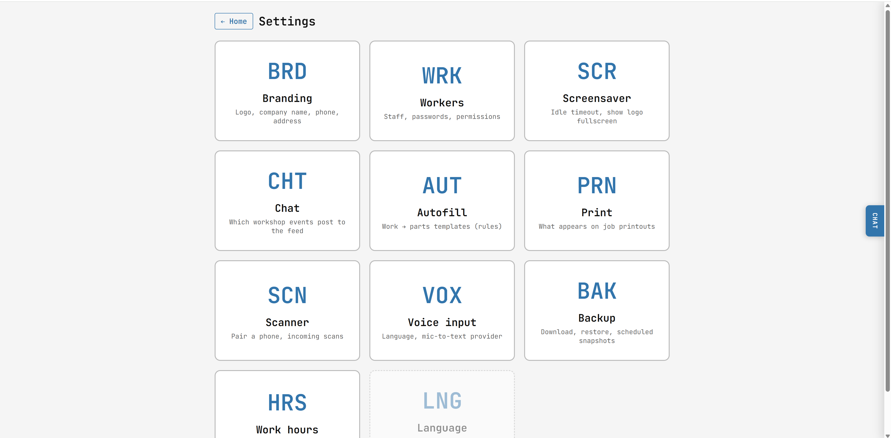
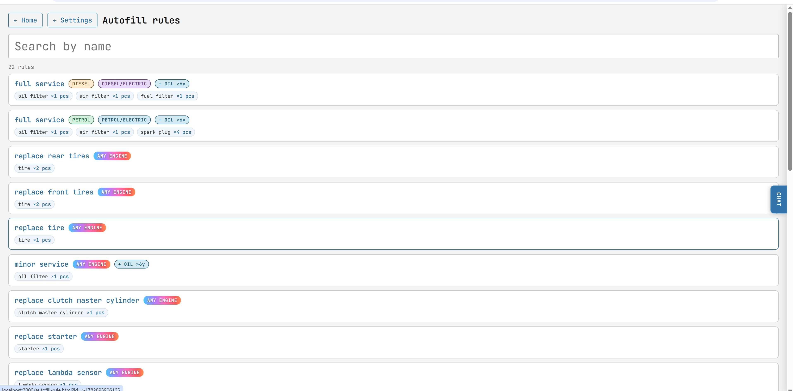
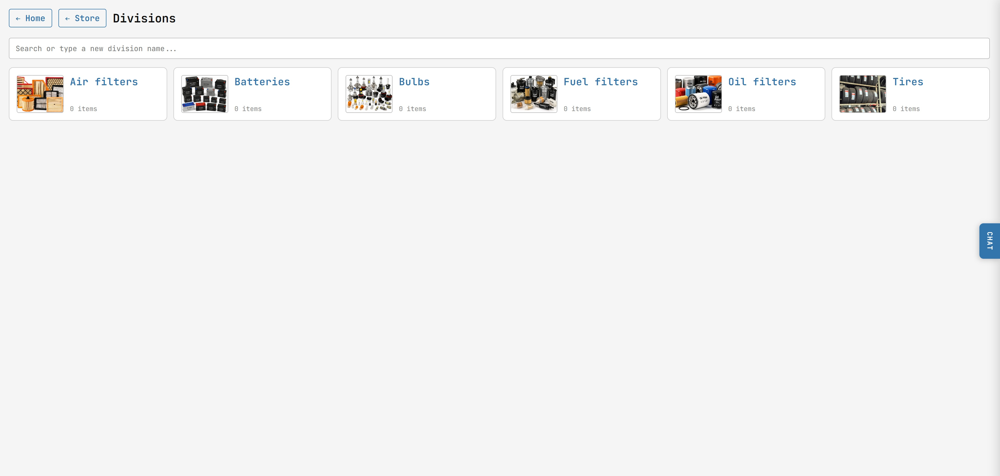

# ie-garage

Local-first garage management for an Irish workshop. One Rust binary
serves a plain-HTML/JS UI, keeps every job, car, part and worker as a
JSON file on disk, and works offline.

Built for [Cleere Auto Services](https://github.com/gravitymir/ie-garage)
(Water Rock, Midleton, Co Cork). The design generalises — the same
setup runs for any small independent workshop.

## Screenshots

### Home

The tile grid is the daily entry point: **Cars**, **Jobs**, **Store**,
**Settings**. A live wall-clock and a counter strip at the bottom show
the shop's state at a glance.



### Settings hub

Every setting lives behind a three-letter tile so the mechanic sees
what's available without hunting menus: Branding, Workers, Screensaver,
Chat, Autofill, Print, Scanner, Voice, Backup, Work hours, Language.



### Autofill rules

Type "full service" into a job's Work description and every recommended
part (oil filter, air filter, spark plugs …) auto-appends. Rules are
filtered by fuel type; there's an add-on that appends every
manufacturer-recommended engine oil pulled from the car's oil archive.



### Store — Divisions

Store inventory is grouped by division (Tires, Bulbs, Batteries, Oil
filters, Air filters, Fuel filters …). Type into the search box to add
a new division on the fly.



## What it does

- **Cars** — vehicle records tied to Irish plates, oil archive attached
  per car, VIN with ISO 3779 validation, fuel type + gearbox badges,
  hover photo previews from the jobs list.
- **Jobs** — one JSON per repair, Work performed / Parts used / Notes
  as inline tables, pause / resume / done timeline with lunch-hour
  deduction, print sheet in the shop's paper Work Order layout,
  autofill from templates.
- **Store** — divisions with photos, per-item counts and barcodes,
  stocktake screen with QR-scanner pairing.
- **Workers** — staff records, plain-text passwords (nominal auth for
  a small shop), assigned worker per job, "worked by" on printouts.
- **Chat** — a lightweight event feed: check-in / job done / job
  reopened events with clickable plate + job links, presence counter,
  server-side polling.
- **Autofill** — trigger phrases → template of parts. Fuel-type
  filtered, with an optional "add all recommended engine oils" mode.
- **Settings** — Branding, Screensaver, Chat retention, Print header,
  Scanner pairing, Voice input, Backup, Work hours, Language.

## How it runs

```bash
cargo run --release
# then open http://localhost:3000
```

All persistent state lives in per-deployment folders next to the
binary: `cars/`, `workers/`, `store/`, `settings/`, `chat/`,
`autofill/`, `scanner/`, `database/`. These are gitignored — the repo
holds source only, never customer data.

## Tech stack

- **Backend**: Rust, [axum](https://github.com/tokio-rs/axum) 0.7,
  tower-http (cors, fs, set-header), reqwest for the oil-archive
  lookup, image + qrcode crates for photo thumbs and scanner pairing.
- **Frontend**: plain HTML + vanilla JS, no build step. One shared
  `save-feedback.js` handles the Save-button flash pattern across
  pages. `chat.js` polls the event feed.
- **Storage**: file-per-record JSON, one folder per entity type.
  Startup migrations upgrade schema in place (see `main.rs` —
  `migrate_job_statuses`, `backfill_car_derived_cache`, etc.).
- **Hosting**: intended for the shop's own PC or a small VPS. Public
  origin is exposed via Cloudflare Tunnel to `astechlab.dev`.

## Repo layout

```
src/main.rs             — the whole backend (single file, axum routes)
public/                 — every HTML page + shared JS
public/save-feedback.js — shared Save-button flash pattern
public/chat.js          — chat / event feed poller
Cargo.toml              — Rust deps
docs/screenshots/       — README images
```

## Status

In active use in the shop. Kept intentionally small: one binary, one
file-per-record layout, no external services beyond an optional
Cloudflare Tunnel and the oil-recommendation lookup.
